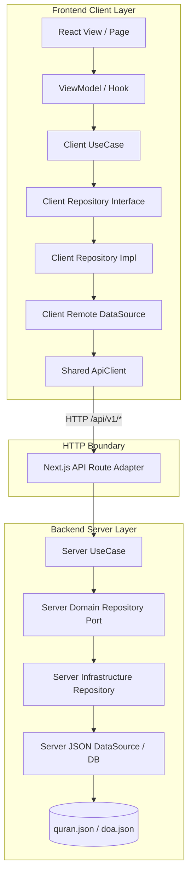

# Quran Ku Web

Production-ready web application and marketing landing page for **Quran Ku** (Al-Quran Digital & Doa Harian Companion). Built using **Next.js 14 App Router**, **TypeScript** (Strict Mode, Zero `any`), **Tailwind CSS**, and **`@needle-di/core`** with clean layered architecture.

This web application also functions as the official web gateway and deep-link fallback for the **Quran Ku Flutter Mobile Application** (`id.excitech.quran_ku`).

---

## 🏛️ Architecture Overview

The codebase is built on **Clean Architecture** and **Domain-Driven Design (DDD)** principles, separating **Client**, **Server**, and **Core** boundaries:



---

## 📁 Directory Structure

```text
src/
├── app/                                 # Next.js App Router & API Route Adapters
│   ├── api/v1/                          # API BFF Boundary to Server Modules
│   │   ├── quran/                       # GET /api/v1/quran, /[surah], /[surah]/[ayah]
│   │   ├── doa/                         # GET /api/v1/doa, /[slug]
│   │   └── deeplink/resolve/            # POST /api/v1/deeplink/resolve
│   ├── quran/                           # /quran and /quran/[surah]
│   ├── doa/                             # /doa and /doa/[slug]
│   ├── open/                            # /open (Deep link app gateway)
│   ├── layout.tsx                       # Root Layout with SEO, OpenGraph & JSON-LD
│   ├── page.tsx                         # Landing Page Adapter
│   ├── robots.ts                        # Dynamic Robots.txt
│   └── sitemap.ts                       # Dynamic XML Sitemap (114 Surahs + 200+ Doas)
│
├── client/                              # Pure Client Application Flow
│   ├── domain/                          # Entities, Repository Interfaces & UseCases
│   │   ├── quran/                       # Surah, Ayah, Reciter domain & UseCases
│   │   ├── doa/                         # Doa domain & UseCases
│   │   └── deeplink/                    # DeepLink domain & UseCases
│   ├── data/                            # API Models, Mappers, Remote Data Sources & Repositories
│   │   ├── quran/
│   │   ├── doa/
│   │   └── deeplink/
│   └── presentation/                    # UI Components, Views, Hooks & Constants
│       ├── components/                  # Reusable UI (Button, Card, Badge, Input, AudioPlayer)
│       └── views/                       # Modular Views (landing, quran, surah, doa, doa-detail, open-gateway)
│
├── core/                                # Shared Client-Safe Utilities & Constants
│   ├── constants/                       # Centralized Routes, API Routes, Deep Links, Config
│   ├── di/                              # Dependency Injection Container (@needle-di/core)
│   ├── http-client/                     # Shared ApiClient wrapper for fetch
│   ├── theme/                           # Brand & Semantic Color Tokens
│   ├── translator/                      # Locale Translator (ID, EN, ZH)
│   ├── types/                           # Standardized API response types
│   └── utils/                           # Slug generator, deep link caller, Arabic formatters
│
└── server/                              # Server-Only Modules & Infrastructure
    ├── data/                            # Static Datasets (quran.json, doa.json)
    ├── modules/
    │   ├── quran/                       # Domain, Application, Infrastructure & quran.module.ts
    │   ├── doa/                         # Domain, Application, Infrastructure & doa.module.ts
    │   └── deeplink/                    # Domain, Application, Infrastructure & deeplink.module.ts
    └── shared/                          # Server errors, Zod validation, HTTP response helpers
```

---

## 🔗 Deep Link & Android App Link Integration

### 1. Supported URL Schemes

The web application maps seamlessly to the **Quran Ku Flutter mobile application**:

| Resource | Canonical Web URL | Mobile Deep Link |
| :--- | :--- | :--- |
| **Home** | `https://quran-ku.com` | `quranku://quran-ku.com` |
| **Quran List** | `https://quran-ku.com/quran` | `quranku://quran-ku.com/quran` |
| **Surah Detail** | `https://quran-ku.com/quran/2` | `quranku://quran-ku.com/quran/2` |
| **Specific Ayah** | `https://quran-ku.com/quran/2?ayah=255` | `quranku://quran-ku.com/quran/2?ayah=255` |
| **Doa Detail** | `https://quran-ku.com/doa/doa-sebelum-tidur` | `quranku://quran-ku.com/doa/doa-sebelum-tidur` |

### 2. Android Digital Asset Links (`assetlinks.json`)

Located at `public/.well-known/assetlinks.json`. For verified **Android App Links (`android:autoVerify="true"`)**, replace the placeholder certificate fingerprint with the production SHA-256 fingerprint:

```json
[
  {
    "relation": ["delegate_permission/common.handle_all_urls"],
    "target": {
      "namespace": "android_app",
      "package_name": "id.excitech.quran_ku",
      "sha256_cert_fingerprints": [
        "__REPLACE_WITH_PRODUCTION_RELEASE_SHA256_CERT_FINGERPRINT__"
      ]
    }
  }
]
```

---

## 💉 Dependency Injection (`@needle-di/core`)

Client-side use cases and repositories are registered centrally in `src/core/di/register-client-dependencies.ts` and resolved via `getService(TOKENS.<ServiceName>)` inside React hooks:

```typescript
import { useMemo } from "react";
import { getService } from "@/core/di/container";
import { TOKENS } from "@/core/di/tokens";

export function useQuranList() {
  const getSurahListUseCase = useMemo(
    () => getService(TOKENS.GetQuranSurahListUseCase),
    []
  );
  // ...
}
```

---

## 🚀 Getting Started

### Prerequisites

- **Node.js**: v18+ (tested on Node v24)
- **pnpm**: v11+ (or npm / yarn)

### Installation

```bash
# Install dependencies
pnpm install

# Run development server
pnpm dev
```

Open [http://localhost:3000](http://localhost:3000) in your browser.

---

## 🧪 Testing

Run the comprehensive unit test suite:

```bash
pnpm test
```

### Test Coverage includes:
- **Server Quran Module**: Listing, searching, surah details, specific ayah retrieval, error handling.
- **Server Doa Module**: 200+ daily prayers, keyword search, slug resolution, not found handling.
- **Server DeepLink Resolver**: Canonical URLs, custom schemes, query extraction, security against open redirects and malicious protocols (`javascript:`).
- **Server Zod Validation**: Range boundaries (Surah 1..114), positive Ayah numbers, safe alphanumeric slugs.
- **Client Data Mappers**: Exact transformation of API models to Domain entities.

---

## 📦 Production Build

```bash
pnpm build
pnpm start
```

---

## 🛡️ Architectural Non-Negotiables

1. **Zero `any` Policy**: Strict TypeScript checking across all modules, tests, and mappers.
2. **Core-First**: Shared constants (`routes.ts`, `api-routes.ts`, `deep-link-routes.ts`, `colors.ts`) must always be used instead of hardcoded strings or values.
3. **No Direct Data/Server Access in Views**: UI components only interact with custom hooks, which invoke Domain Use Cases resolved via DI.
4. **Authoritative Server Validation**: All incoming requests to API route adapters are parsed and strictly validated with Zod.
5. **Safe Deep Linking**: Open App actions prevent infinite loops and protect against arbitrary redirects.
